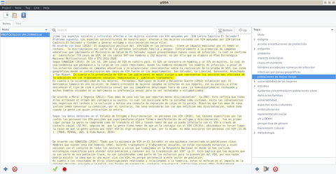

# gQDA - A qualitative data analysis application

gQDA is an application for analyzing texts. It allows the user to load a set of texts (notes), mark fragments inside
them and assign tag to fragments. You can build a conceptual tree with tags. 

Requiriments:

- GTK+ 3.0
- GTK source view 4.0
- libxml2

Installing and running:

    $ make
    $ ./gqda

